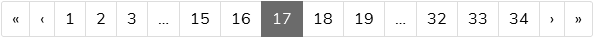

# Pagination

This makro allows you to render a pagination in various ways.

If you are using rn_base and want to print a pagebrowser based on the filter:

```twig

{{
    Pagination.pageBrowser(
        {
            pointer: pagebrowser.getPointer + 1,
            lastPage: pagebrowser.getLastPage + 1,
        },
        {
            firstIsNull: 1,
            pointerParameterName: 'myqualifier::%s'|format(pagebrowser.getParamName('pointer')),
        }
    )
}}
```

This will output the following pagination (bootstrap based):




For more options, individual labels see
[Macro/Pagination.html.twig](../../../Resources/Private/Template/Macro/Pagination.html.twig)
